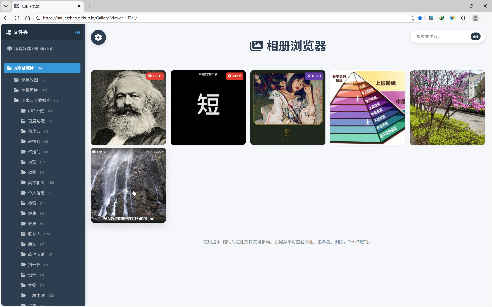
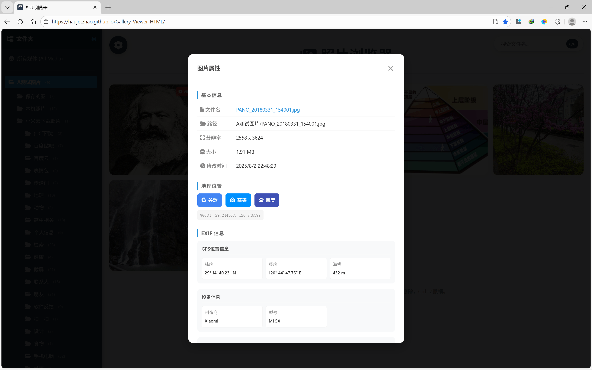

# 📸 Gallery Viewer (Photo album browser)

A modern, lightweight and **fully localized** Web Photo album browser. Supports multiple media formats such as pictures, videos, and audios. No need to upload, protect privacy, and smoothly manage and view your local media library directly in the browser.

## ✨ Core Highlights

*   **🛡️ Privacy First**: Based on File System Access API Build, all operations are done locally, and media data is never uploaded to the cloud.
*   **🚀 Ultimate Portability**: Static HTML File entry does not require a local server and can be used anytime.
*   **⚡ high performance**:
    *   **Virtual scrolling & Lazy Loading**: Handle folders of thousands of media files with ease.
    *   **IndexedDB Cache**: Automatically cache thumbnails and load them instantly when opened a second time.
*   **🎨 modern UI/UX**: Supports smooth zooming, dragging and panning, and keyboard shortcut navigation.

## 🛠️ Features

*   **🎬 Multimedia support**:
    *   **picture**: JPG, PNG, GIF, WebP, BMP, SVG
    *   **video**: MP4, WebM, OGG, MOV, MKV, FLV, AVI
    *   **Audio**: MP3, WAV, OGG, FLAC, M4A
*   **📁 File tree navigation**: The sidebar synchronizes the file system structure in real time and supports expansion/collapse.
*   **🔍 File management**:
    *   File operations: rename, delete, drag and move (all available Ctrl+Z revoked)
    *   Folder operation: delete (irreversible, will be confirmed twice)
    *   Multiple sorting (name, size, date) and filename filtering.
*   **ℹ️ Detailed metadata information**:
    *   **picture EXIF**: Camera parameters (aperture, shutter, ISO wait).
    *   **Video Information**: Resolution, duration, bitrate.
    *   **Audio ID3**: Artist, album, thumbnail.
    *   **Intelligent map positioning**: automatic identification GPS information, provide **Google, Amap, Baidu** Three types of map jumps supported WGS84 Coordinates are automatically corrected.
*   **🖱️ Efficient interaction**:
    *   **Auto scroll**: Automatically scroll when the mouse is hovering at the edge of the screen.
    *   **Shortcut key support**:`Ctrl+C` Copy pictures, switch with arrow keys, ESC closure.

## 💻 technology stack

*   **Core**:Native JavaScript (ES6+), HTML5, CSS3
*   **Storage**: IndexedDB (LocalForage style encapsulation)
*   **API**: File System Access API
*   **Libraries**:
    *   `exif-js`: Metadata reading
    *   `SparkMD5`: File hash calculation
    *   FontAwesome: Icon library

## 🚀 quick start

1.  Download the code for this project.
2.  Double click directly `index.html` Open.
3.  The usual click interface "**Open folder**" button to authorize access to your image directory.
4.  Enjoy!

## ⚠️ Compatibility Notes

due to using **File System Access API**, this project currently supports the following browsers (desktop):
*   Chrome / Edge (86+)
*   Opera

*Note: Firefox for Desktop Currently this is not natively supported API full functionality. *

---
*Created with ❤️ by Antigravity*
